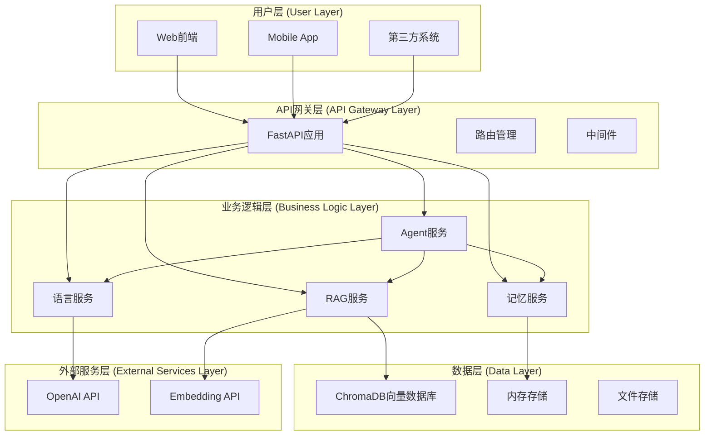
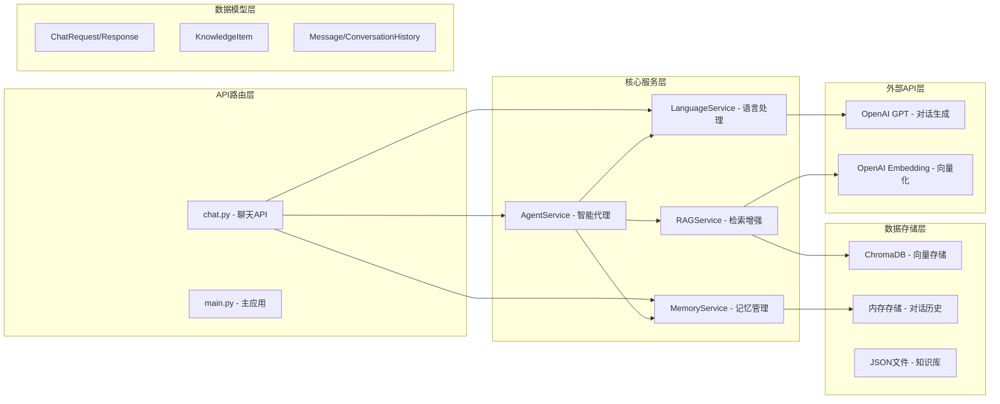
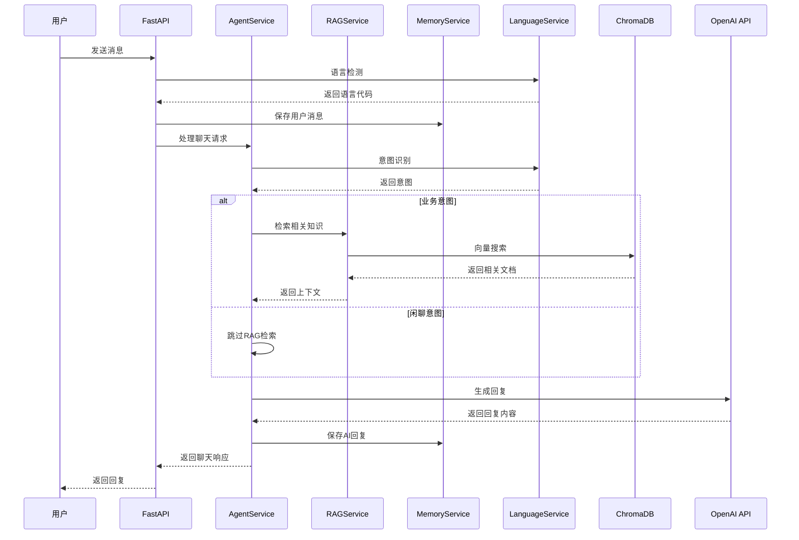
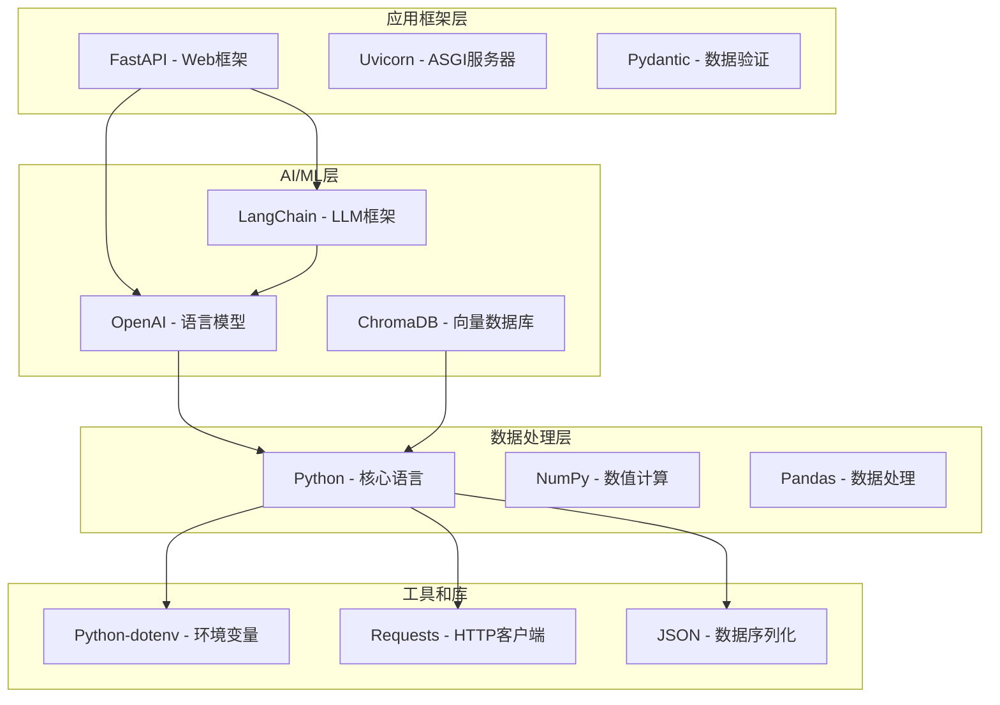
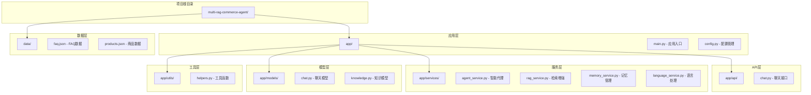
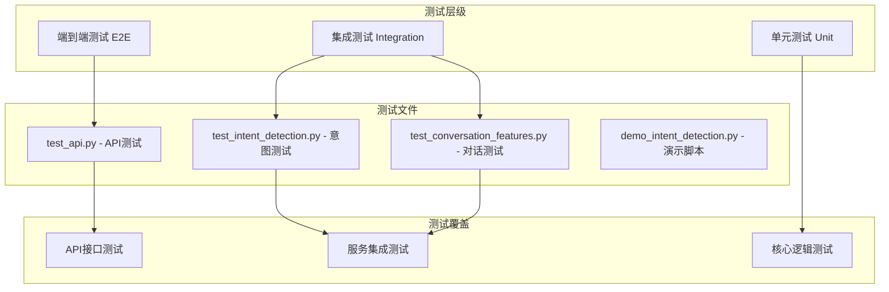
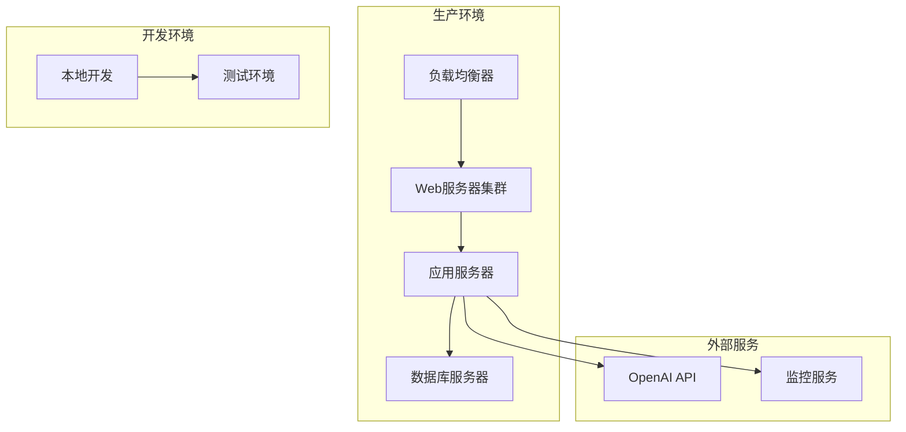

# Multi-RAG Commerce Agent 项目架构

## 整体架构图

```mermaid
graph TB
    subgraph "用户层 (User Layer)"
        A[Web前端] 
        B[Mobile App]
        C[第三方系统]
    end
    
    subgraph "API网关层 (API Gateway Layer)"
        D[FastAPI应用]
        E[路由管理]
        F[中间件]
    end
    
    subgraph "业务逻辑层 (Business Logic Layer)"
        G[Agent服务]
        H[RAG服务]
        I[记忆服务]
        J[语言服务]
    end
    
    subgraph "数据层 (Data Layer)"
        K[ChromaDB向量数据库]
        L[内存存储]
        M[文件存储]
    end
    
    subgraph "外部服务层 (External Services Layer)"
        N[OpenAI API]
        O[Embedding API]
    end
    
    A --> D
    B --> D
    C --> D
    D --> G
    D --> H
    D --> I
    D --> J
    G --> H
    G --> I
    G --> J
    H --> K
    I --> L
    J --> N
    H --> O
```

## 详细服务架构

```mermaid
graph LR
    subgraph "API路由层"
        A1[chat.py - 聊天API]
        A2[main.py - 主应用]
    end
    
    subgraph "核心服务层"
        B1[AgentService - 智能代理]
        B2[RAGService - 检索增强]
        B3[MemoryService - 记忆管理]
        B4[LanguageService - 语言处理]
    end
    
    subgraph "数据模型层"
        C1[ChatRequest/Response]
        C2[KnowledgeItem]
        C3[Message/ConversationHistory]
    end
    
    subgraph "数据存储层"
        D1[ChromaDB - 向量存储]
        D2[内存存储 - 对话历史]
        D3[JSON文件 - 知识库]
    end
    
    subgraph "外部API层"
        E1[OpenAI GPT - 对话生成]
        E2[OpenAI Embedding - 向量化]
    end
    
    A1 --> B1
    A1 --> B3
    A1 --> B4
    B1 --> B2
    B1 --> B3
    B1 --> B4
    B2 --> D1
    B3 --> D2
    B4 --> E1
    B2 --> E2
```

## 数据流架构

```mermaid
sequenceDiagram
    participant U as 用户
    participant API as FastAPI
    participant Agent as AgentService
    participant RAG as RAGService
    participant Memory as MemoryService
    participant Lang as LanguageService
    participant DB as ChromaDB
    participant OpenAI as OpenAI API
    
    U->>API: 发送消息
    API->>Lang: 语言检测
    Lang-->>API: 返回语言代码
    
    API->>Memory: 保存用户消息
    API->>Agent: 处理聊天请求
    
    Agent->>Lang: 意图识别
    Lang-->>Agent: 返回意图
    
    alt 业务意图
        Agent->>RAG: 检索相关知识
        RAG->>DB: 向量搜索
        DB-->>RAG: 返回相关文档
        RAG-->>Agent: 返回上下文
    else 闲聊意图
        Agent->>Agent: 跳过RAG检索
    end
    
    Agent->>OpenAI: 生成回复
    OpenAI-->>Agent: 返回回复内容
    
    Agent->>Memory: 保存AI回复
    Agent-->>API: 返回聊天响应
    API-->>U: 返回回复
```

## 技术栈层级

```mermaid
graph TD
    subgraph "应用框架层"
        A1[FastAPI - Web框架]
        A2[Uvicorn - ASGI服务器]
        A3[Pydantic - 数据验证]
    end
    
    subgraph "AI/ML层"
        B1[LangChain - LLM框架]
        B2[OpenAI - 语言模型]
        B3[ChromaDB - 向量数据库]
    end
    
    subgraph "数据处理层"
        C1[Python - 核心语言]
        C2[NumPy - 数值计算]
        C3[Pandas - 数据处理]
    end
    
    subgraph "工具和库"
        D1[Python-dotenv - 环境变量]
        D2[Requests - HTTP客户端]
        D3[JSON - 数据序列化]
    end
    
    A1 --> B1
    A1 --> B2
    B1 --> B2
    B2 --> C1
    B3 --> C1
    C1 --> D1
    C1 --> D2
    C1 --> D3
```

## 文件结构层级

```mermaid
graph TD
    subgraph "项目根目录"
        A[multi-rag-commerce-agent/]
    end
    
    subgraph "应用层"
        B[app/]
        B1[main.py - 应用入口]
        B2[config.py - 配置管理]
    end
    
    subgraph "API层"
        C[app/api/]
        C1[chat.py - 聊天接口]
    end
    
    subgraph "服务层"
        D[app/services/]
        D1[agent_service.py - 智能代理]
        D2[rag_service.py - 检索增强]
        D3[memory_service.py - 记忆管理]
        D4[language_service.py - 语言处理]
    end
    
    subgraph "模型层"
        E[app/models/]
        E1[chat.py - 聊天模型]
        E2[knowledge.py - 知识模型]
    end
    
    subgraph "工具层"
        F[app/utils/]
        F1[helpers.py - 工具函数]
    end
    
    subgraph "数据层"
        G[data/]
        G1[faq.json - FAQ数据]
        G2[products.json - 商品数据]
    end
    
    A --> B
    B --> C
    B --> D
    B --> E
    B --> F
    A --> G
```

## 测试架构层级

```mermaid
graph TD
    subgraph "测试层级"
        A[端到端测试 E2E]
        B[集成测试 Integration]
        C[单元测试 Unit]
    end
    
    subgraph "测试文件"
        D[test_api.py - API测试]
        E[test_intent_detection.py - 意图测试]
        F[test_conversation_features.py - 对话测试]
        G[demo_intent_detection.py - 演示脚本]
    end
    
    subgraph "测试覆盖"
        H[API接口测试]
        I[服务集成测试]
        J[核心逻辑测试]
    end
    
    A --> D
    B --> E
    B --> F
    C --> J
    D --> H
    E --> I
    F --> I
```

## 部署架构

```mermaid
graph TB
    subgraph "生产环境"
        A[负载均衡器]
        B[Web服务器集群]
        C[应用服务器]
        D[数据库服务器]
    end
    
    subgraph "开发环境"
        E[本地开发]
        F[测试环境]
    end
    
    subgraph "外部服务"
        G[OpenAI API]
        H[监控服务]
    end
    
    A --> B
    B --> C
    C --> D
    E --> F
    C --> G
    C --> H
``` 